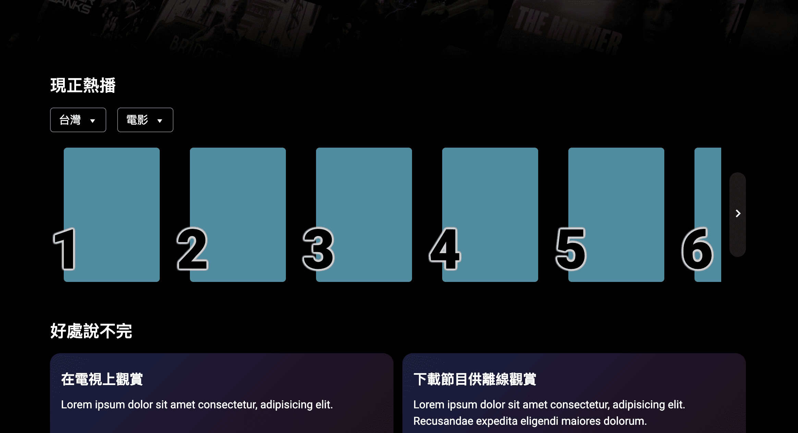
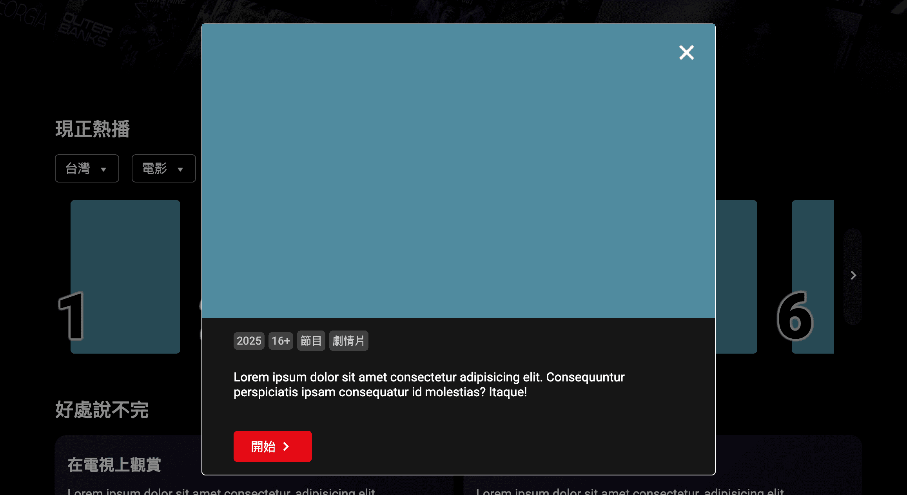
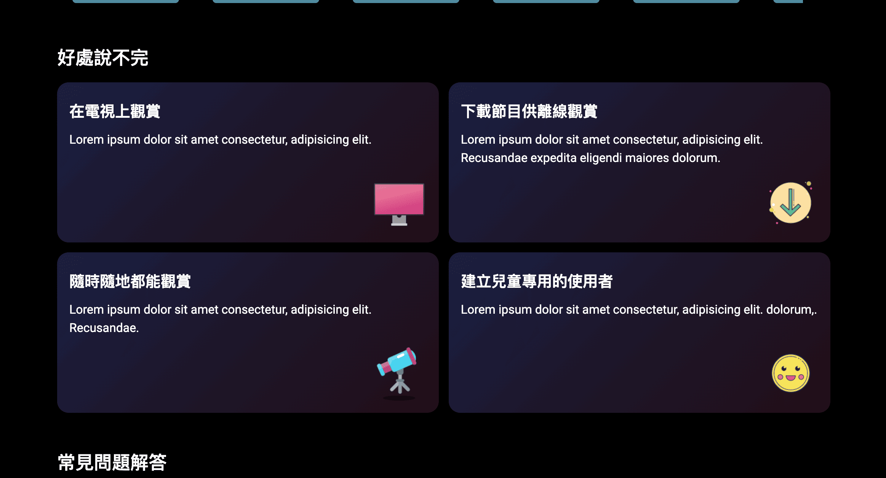
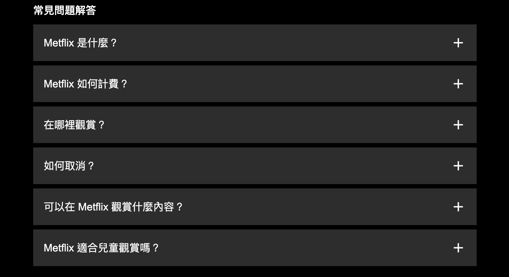
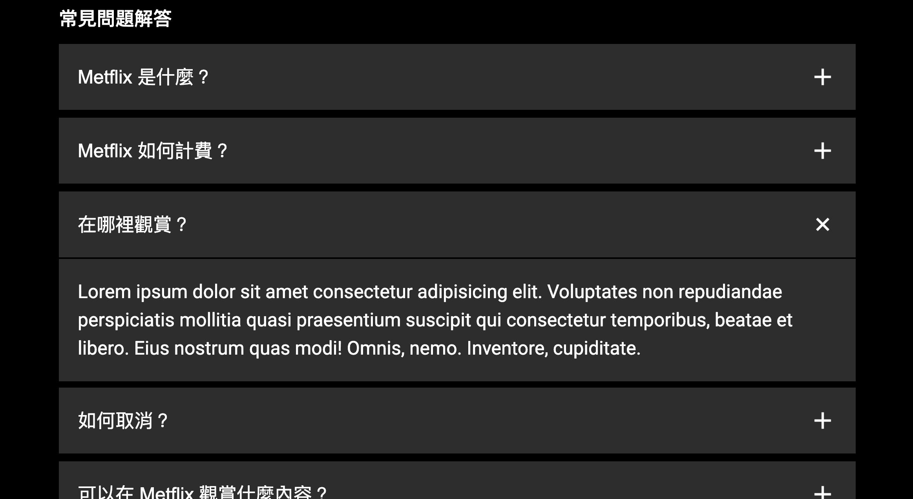
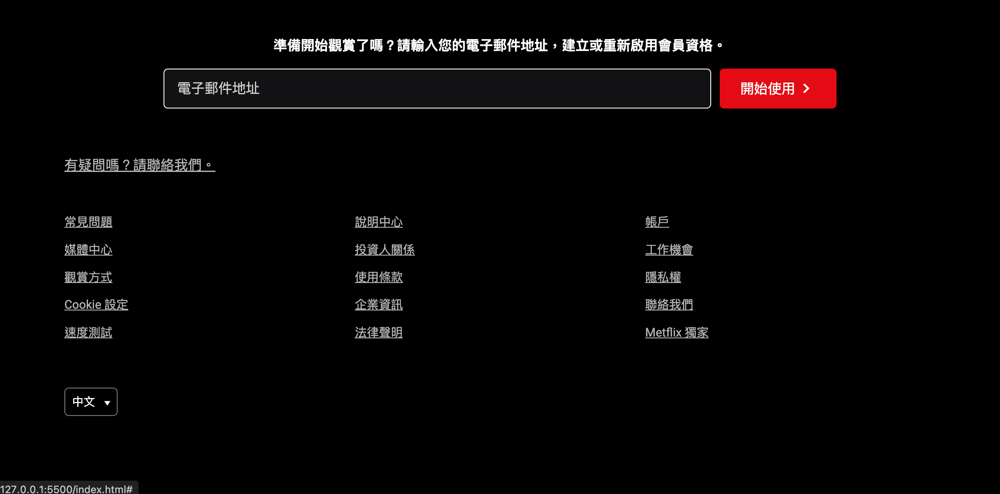
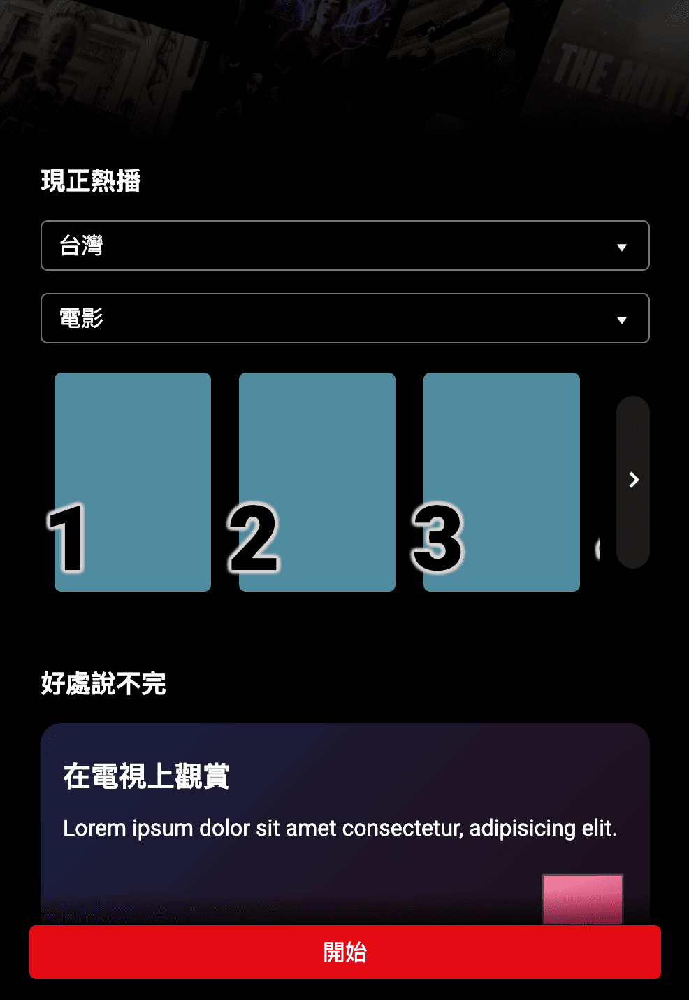

根據用戶點擊"前進"/"後退"按鈕調整滾動位置。
根據容器寬度與元素寬度動態計算滾動距離，並處理滾動邊界，確保按鈕顯示不會被遮擋。

點擊電影排行榜項目即可開啟 Modal，顯示完整影片資訊。
支援背景點擊或按鈕關閉視窗。

當用戶點擊問題按鈕時，根據當前狀態顯示或隱藏問題內容，並確保只有一個問題處於顯示狀態。

根據視窗大小動態啟動或停止滾動事件監聽，並使用節流技術優化效能。
當視窗寬度小於等於 600px 時，啟動監聽滾動事件，根據滾動位置顯示或隱藏按鈕，當視窗大於 600px 時，停止監聽以避免不必要的效能消耗。節流函式確保滾動事件不會過於頻繁地觸發，提升整體性能與流暢度。
